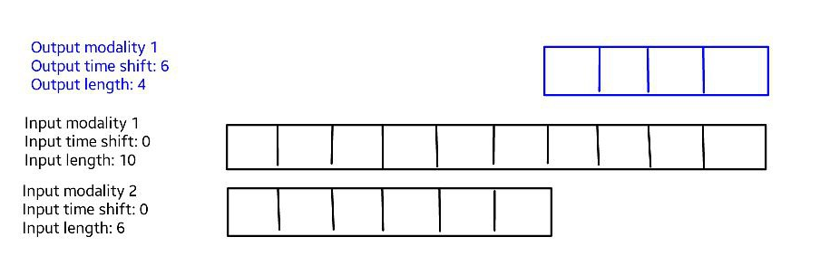
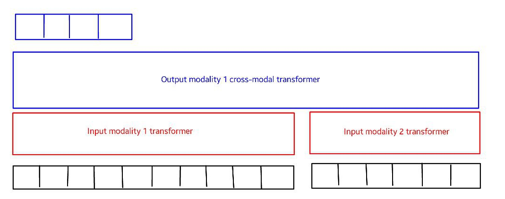

This repo holds the code to perform experiments with the multimodal autoregressive probabilistic model [Transflower](http://metagen.ai/transflower).

Paper: [Transflower: probabilistic autoregressive dance generation with multimodal attention](https://arxiv.org/abs/2106.13871)

Video summary [here](https://www.youtube.com/watch?v=uBnCePehA-Y&ab_channel=GuillermoValle)

_Abstract_

Dance requires skillful composition of complex movements that follow rhythmic, tonal and timbral features of music. Formally, generating dance conditioned on a piece of music can be expressed as a problem of modelling a high-dimensional continuous motion signal, conditioned on an audio signal. In this work we make two contributions to tackle this problem. First, we present a novel probabilistic autoregressive architecture that models the distribution over future poses with a normalizing flow conditioned on previous poses as well as music context, using a multimodal transformer encoder. Second, we introduce the currently largest 3D dance-motion dataset, obtained with a variety of motion-capture technologies, and including both professional and casual dancers. Using this dataset, we compare our new model against two baselines, via objective metrics and a user study, and show that both the ability to model a probability distribution, as well as being able to attend over a large motion and music context are necessary to produce interesting, diverse, and realistic dance that matches the music.

----------

This repo is archived and continued development is found in [this repo](https://github.com/MetaGenAI/multimodal-transflower).

# Overview of the repo

It is structured into folders which hold the code or assets for different parts of the workflow. I am using a general framework which was inspired by the CycleGAN project, and then modified to work with [Pytorch Lightning](https://www.pytorchlightning.ai/).

* `Training` holds the training code. The entry point file is `train.py`
  * `Datasets` holds the pytorch datasets and also convenience utilities to create the datasets and dataloaders. A dataset is defined as a class inheriting from BaseDataset, with a class name which should be "DatasetNameDataset" where "DatasetName" (but lowercased) will be the name used to refer to the dataset in the options.
  * `experiments` holds the results of training runs, in folders given by the experiment id. Its contents are .gitignored
  * `options` holds utilities to set up general argument options, as well as collect the options specific to the model, or dataset, specified for the experiment
  * `hparams` holds the configuration files with hyperparameters that I'm using to run different experiments
* `models` defines the models as Lightning modules (actually they inherit from BaseModel, for some convenient common functions). A model is defined as a class inheriting from BaseModel, with a class name which should be "ModelNameModel" where "ModelName" (but lowercased) will be the name used to refer to the model in the options.
* `inference` holds the code and results for testing the model at inference time. In our case, this means generation, as we are working with generative models. Note that this is just a skeleton, and it relies on a `generate` function defined on each model.
* `feature_extraction` holds code to extract features. At the moment functions to process features for audio and motion data are available
* `data` holds the actual data, and a couple of scripts to download data
* `analysis` holds code to analyze and explore the data, as well as visualizing results. Beware of files named "sandbox", as they are used by me using [Hydrogen](https://nteract.io/atom), so the outside observer would look like a jumbled mess of code (which it is). It is literally a sandbox of code, to play around.

# How to run training and inference

The scripts in the root folder are for running the common high level tasks. `script_generate.sh` generates samples for the model of a particular experiment. `script_train.sh` trains a model on some data, as specified by a particular hyperparameters file, though any of the hparams can be overriden as argparse arguments. You can add `--help` to to get some explanation of what the different options/hparams do. Note that the options parser (in `training/options/base_options.py`) gathers the set of available options by aggregating the base options with the options defined in the particular model and dataset you have specified in the `model` and `dataset_name` options.

You can run `./script_train.sh transflower_expmap` to train using the hparams file in `training/hparams/dance_combined/transflower_expmap.yaml`, which is the configuration we used in the paper. This assumes the data is inside `data/dance_combined3` but can be changed with the `--data_dir` argument.

You can run `./script_generate.sh transflower_expmap the_basement --generate_bvh --data_dir data/dance_combined3 --generate_video` to generate using the model trained in the experiment `transflower_expmap`, on the sequence with sequence id `the_basement`. This sequence_id is just the basename of the original sound file.

## Training on your own data

First install requirements with `pip install -r requirements.txt`

Then, I assume you have a folder, say inside `data/myData` which contains bvh files and wav files which are paired and time-syncced. In particular, they should have the same basename, for example, `sequence1.bvh` and `sequence1.wav` would be paired. With that, you can run `./feature_extraction/audio_feature_extraction.sh data/myData` and `./feature_extraction/motion_feature_extraction.sh data/myData` to extract the audio and motion features. You can pass the argument `--replace_existing` if you want to recompute features with the same names. This will create files with names like `sequence1.audio_feats_scaled_20.npy` and `sequence1.expmap_cr_scaled_20.npy`. The `expmap_cr_scaled_20` and `expmap_cr_scaled_20` parts are the "feature names" which should match the ones that are given in the `input_modalities` arguments when training (see the different hparams files). There are different audio and motion feature options available which can be seen in the different scripts called by `audio_feature_extraction.sh` and `motion_feature_extraction.sh`.

One this is done, you can now call `./script_train.sh transflower_expmap --data_dir=data/myData` to train, as mentioned above. The checkpoints and results will be found in `training/experiments/transflower_expmap`. You can use `tensorboard --logdir training/experiments` to track progress using tensorboard.

*More options*: You can specify a different experiment name which will look for a different hparams file inside `training/hparams/dance_combined`. You can also directly pass arguments to `./script_train.sh`. You can see some of them by typing `python training/train.py -h`, but this is not a complete list, as some arguments are specific to datasets and models. You can see the model and dataset specific arguments by looking at their class definitions. The dataset definition is in `training/datasets/multimodal_dataset.py` and the model is in `models/transflower_model.py`. 

## Generating a dance

To give a more concrete example, and following the exact workflow in the provided [Google colab]() which I recommend using to try the model, assume we have a filename called `myCoolSong.wav`. After installing dependencies, we can create a folder to store it, and also one for the seeds and pretrained models, and download them. This assumes you have [gsutil installed](https://cloud.google.com/storage/docs/gsutil_install).

```
pip install -r requirements.txt
apt-get install ffmpeg
mkdir songs
mkdir training/experiments
gsutil -m cp -r gs://metagen/models/transflower_expmap_old training/experiments/
gsutil -m cp -r gs://metagen/models/transflower_expmap_finetune2_old training/experiments/
gsutil -m cp -r gs://metagen/scalers/* songs/
gsutil -m cp -r gs://metagen/seeds/* songs/
```

We then extract the music features as follows

```
chmod +x ./feature_extraction/audio_feature_extraction_test.sh
chmod +x ./feature_extraction/script_to_list_filenames
./feature_extraction/audio_feature_extraction_test.sh songs/
```

Finally, we can generate as follows

```
./script_generate.sh transflower_expmap_old myCoolSong --generate_bvh --generate_video --data_dir=songs
```

and the result will be inside `inference/generated/transflower_expmap_old/videos`.

-----------------

Next we explain in some more detail the structure and options of the general dataset format we use, as well as models available and their main options

# Multimodal dataset

The multimodal dataset in `training/datasets` is designed to be a general purpose dataset which works for all the experiments within the scope of this repository.
It expects numpy arrays corresponding to time-synced and same-length sequneces of a number of "input modalities" and a number of "output modalities", to be found in the folder given in `--data_dir` argument. These should be numpy arrays of rank 2, where the first dimension is the sequence dimension, and the second one is the feature dimension.
The files in the folder should be formated as `[sequence_id].[feature_name].npy`. The dataset will read which sequence ids to use for training from a file named `base_filenames_train.txt` on the same folder as the data, and then it will pick up the desired input and output modalities, according to the modalities specified (comma-separated) in the arguments `--input_modalities` and `output_modalities`.
It will constract individual data points from these sequences, by specifying the length of window that you wish for each input modality (comma-separated) in `--input_lenghts`, and for each output modality (comma_separated in `--output_lengths`, you can provide offsets for each modality in `--output_time_offsets` and `--input_time_offsets`, both zero-indexed

In the image below you see an illustration of how a data point would look like with two input modalities (e.g. music, and movement), and one output modality (e.g. movement), with the specified lengths and offsets. This way of specifying data points is quite general and can conver a variety of tasks, including the multimodal autoregressive generation tasks we are studying here.



Note that although not a technical requirement for the above dataset to work, for more tasks, we expect the sequences to be sampled at the same frequency, and have the same length (the later requirement could be relaxed, as we are gonna take subwindows of different sizes, but it at the moment it's what it expects)

# Multimodal models

Most of the models studied here are designed to work with the above multimodal dataset, and so they will build a model to fit the corresponding data point structure (number, and lengths, of the input and output modalities). The modality dimensions (number of features) are specified in the `--dins` and `--douts` arguments. 

## Transformer model

The basic (multimodal) transformer model is a generalization of the model proposed in [this paper](https://arxiv.org/abs/2101.08779), to work with any number of input or output modalities.

Here's an example of how it would look with the input and output modalities described above: 



Note:

* The "output" of the model is taken to be the first N outputs of the cross modal transformer, starting from the first, where N is the desired `output_length`. Note that this limits the output length to be at most the sum of input lengths. One could extend the model to relax this
* If there were multiple output modalities, the input modality transformers would be shared, but a new "cross-modal" head would be added, per output modality.

## Transflower model(s)

The idea of using autoregressive normalizing flows (NF), in particular for probabilistic modelling of motion, was inspired by [MoGlow](https://arxiv.org/abs/1905.06598). The idea of the Transflower model is to combine that idea with the multimodal transformer defined above. This can be done simply by feeding the output of the multimodal transformer (MT) as conditioning for the normalizing flow, which is done through the coupling layers of the normalizing flow, as illustrated below.


Within the normalizing flow there are a series of different architectural choices possible, some of which correspond to the model variations in the `model` folder. 
* The `Transflower` model itself is using the [Flow++](https://arxiv.org/abs/1902.00275) architecture, but with hyperparameter choices that simplify the model as we are not working with images. Furthermore, the coupling neural network has been replaced with a Transformer network.
* The `Transformerflow` model is an earlier iteration which is the same, except that the coupling neural network has been left to be the same as what it was for Flow++.
* The `Transglower` model is an attempt at combining the MT with the original MoGlow model (which feeds an LSTM into the coupling layers of the Glow model, which is very similar to the Flow++ one we are using, given our simplified hyperparameters).
* There's also an implementation of the original `MoGlow` model itselft to be used as a baseline
* The `ResidualFlower` model is a new experiment I'm trying now where the mean of output is predicted by a (deterministic) MT, and the NF models only the deviation (residal) from the mean.

You can see some more details in [this post](https://openlab-flowers.inria.fr/t/transflower-high-dim-continuous-probabilistic-models-with-attention-and-their-applications/909)

### Normalizing flows

A very quick summary of normalizing flows. Normalizing flows are implicit generative models, which also allow computation of the exact probability (so they are explicit at the same time? I find the nomenclature confusing). This is done because the function mapping the stochastic latent to the output is reversible. We usually define the following
* The forward flow, is a function mapping a vector/tensor in the "output domain" to a vector/tensor of the same size, in the "latent domain". This flow has to be reversible, which in particular implies that the Jacobian is non-singular
* The reverse flow, is the inverse of the above function. This is the flow that allows to sample from the model, by sampling a latent vector from the latent distribution, and sending it through the flow.

The model is trained by exact likelihood maximization. We can compute the likelihood of the data, by using the transformation of variables formula, to compute P(X) as the determinant of the Jacobian of the forward flow, times Prior(f(X)), where Prior is the latent distribution (usually a standard Gaussian), and f(X) is the Z to which X is mapped by the forward flow. By the chain rule, the Jacobian determinant of the flow, can be decomposed into a product of the Jacobian determinant of each of the atomic operations in the flow. There are tricks to make these Jacobians more efficient to compute. `sldj` on the code I think stands for "sum of log determinant of Jacobian", as the product becomes sum after taking the log.

Most of the ingenuity in desining normalizing flows has gone into desining expressive reversible functions. The [Real NVP paper](https://arxiv.org/abs/1605.08803) introduced reversible "coupling layers" which are a very flexible (and clever I think) class of reversible transformations, which also have simple Jacobians. I recommend the Real NVP paper as a good introduction to NFs. The [Glow paper](https://arxiv.org/abs/1807.03039) introduced reversible 1x1 convolutoins, which are also often used.

MoGlow made use of the coupling layers to make the NF conditional on the recent history, thus making the model autoregressive.

As an interesting recent development in NFs, there's [FFJORD](https://arxiv.org/abs/1810.01367), which uses the interesting fact that as ODEs are reversible, one can use Neural ODEs to make NFs!

There's a [recent review](https://arxiv.org/abs/2103.04922) of different types of probabilistic deep generative models. However, it only focuses on images, so it is unclear how much their conclusions transfer to other domains. I think the question of which generative models work well for different tasks is a very interesting and valuable one, as these models are so fundamental and useful for real-world applications, where stochasticity and uncertainty means that we need to model probability distributions!

As a very quick summary, from that paper + my experience, the main advantages of NFs are:
* They model the distribution very faithfully, avoiding problems of model collapse, for example. This typically means they are better at producing diverse solutions than models that suffer from mode collapse.
* They do exact inference, meaning that if your model is flexible enough, and your optimizer is reasonable, you shouldn't have stability problems like often found in GANs.

The main disadvantages are:
* They are slower at training and inference. I am not sure how much this is the case quantiatively, and I think also it may depend on different factors, like how good your optimizer is. But generally, a well-tempered GAN can train faster, and also will be faster at inference time. I think the slower inference of NFs is mostly because they are less parameter efficient (you need larger models to reach similar performance). Continuous NFs (like FFJORD) seem to be a lot more parameter efficient, but they are slow for other reasons, namely that Neural ODEs are slow.
* Because they are so good at modelling the distribution of the data, they can also model errors/flukes in the data, which show up (with the frequency at which they showed in the data), while some less powerful models may actually be unaffected by these outliers.

Overall, at least in image world (less clear about other modalities), they produce better quality results than VAEs, but worse than GANs. However, they may be more stable and thus easier to train than GANs. I think GANs are worth giving a try, though. Other models that I think are worth giving a try are: VQ-VAEs and energy-based models, which have different strengths and weaknesses, but have both shown very good performance at modeling complex distributions (again mostly in images). VQ-VAEs are also state of the art at music modelling, and close to SOTA at image modelling, so they are worth looking at I think. I am giving NFs a try mostly because they are SOTA for motion modelling currently, and they have nice theoretical properties (thanks to exact inference)

# Data

<!-- You can get a copy of the (already preprocessed) AIST++ data by running the file `./copy_from_gs.sh` in `data/`. It needs `gsutils` installed. With that you can begin running experiments using the provided scripts (you may need to add the flag `--fix_lengths` first time you run it as some modalities for the same sequence dont have quite the same length (coz my preprocessing isnt perfect:P), and may differ by one or two samples in length.

This data is extracted from a dataset of dance videos. More data comming soon.

You can also ask me for a copy of the MoGlow dataset if you want. I'm currently playing with the model, but soon will begin playing again with the data, and organize it more.  -->

We are compiling the dataset, which comprises several sources, and will release it soon. 


<!-- Some parts of the dataset are already publicly available. The AIST++ dataset is available [here](https://google.github.io/aistplusplus_dataset/factsfigures.html), and most of the VR dances are available from several playing lists including .... These dances can all be visualized in 3D in the VRChat world Papa Dance by lox9973. The VR dance videos can be converted to bvh (and retargetted to any humanoid skeleton) using [this Unity tool](https://github.com/guillefix/shadermotion-bvh-utils), and the features processed as explained [in the code](https://github.com/guillefix/transflower-lightning). However, we will release the full set of features soon, so that it will be easier to replicate and build on this dataset:) -->

# Cite

If you use models or code from this repo, cite us using

```
@article{vallepérez2021transflower,
      title={Transflower: probabilistic autoregressive dance generation with multimodal attention}, 
      author={Guillermo Valle-Pérez and Gustav Eje Henter and Jonas Beskow and André Holzapfel and Pierre-Yves Oudeyer and Simon Alexanderson},
      year={2021},
      eprint={2106.13871},
      archivePrefix={arXiv},
      primaryClass={cs.SD}
}
```

# Community

I'll be continuing some extensions to this work, with the aim to develop open source tools and datasets. You can join [this community discord](https://discord.gg/HQ8Crcw), where we discuss progress in this project, which is part of an umbrella project to explore and develop the intersection between VR and AI:). See http://metagen.ai
